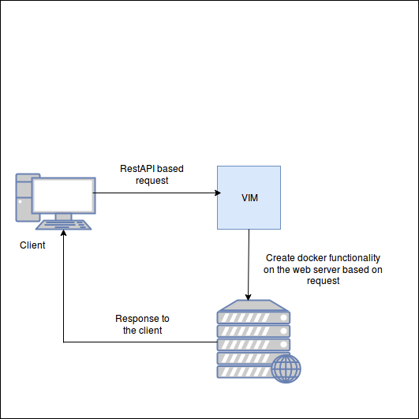

# DockerEcosystemUsingRestAPI

The goal of this project was to create a server side application which will work as VIM(Virtualized infrastructure managment) to do different functions of docker in remote server. 

The following diagram shows the basic functionly of this application
 

The functions which have been implemented in the code are in below 

1. Get docker info
2. Show image list
3. Show container list
4. Pull image from docker hub
5. Create container 
6. Run a container
7. Inspect running container
8. Stop all containers
9. Remove all containers
10. Create docker bridge network
11. Pass a command inside of a container

For this project `Python` version `3.5` has been used. For web functionlity `Flask` framework has been used. And `docker` framework ahs beed used to implement docker functions in the code. 
